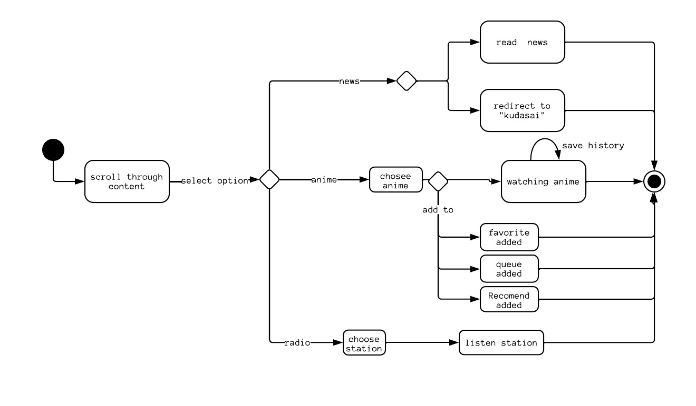

# Aruppi Project
This is the documentation and implementation of Aruppi project to develop in the programming models course, at Universidad Distrital. Which applies creational, structural, behavioral  patterns, object oriented programming, including databases and web services. Looking for apply good practices.

## Business Model
Access to Japanese culture content is often limited or has some problems, such as publicity. In contrast to this, Aruppi is an application that looks to collect all the Japanese culture in an a same place.

## User Stories
- As an administrator, I want to add anime, so what to have updated content. 
- As an administrator, I want to add news, so what to update the content 
- As an administrator, I want to remove news, so what to have updated information.
- As a user, I want to pause a station, so what to stop listening music.
- As a user, I want to play a station, so what to listen to music.
- As a user, I want to watch anime, so what I hang out.
- As a user, I want listen Japanese stations, so what I learn Japanese music and know facts of their country.
- As a user, I want know the news about Japanese culture, so what I keep me informed.
- As a user, I want add my favorite content, so what I categorize them according to my preferences.
- As a user, I want see my history of episodes, so what I don't lose the thread of it.
- As a user, I want add content to the list queue, so what I can see it after.

## Technical Definitions
### Tools to use
The tools that will be used in the construction of this project are: 
-  Visual Studio code, a code editor.
-  Python programming language.
-  Docker to facilitate the implementation and execution of the project.
-  Lucidchart for the creation of software desing.
-  FastAPI web framework to build efficient RESTful APIs.

### Entities
- User: UserId, Password, satus, grants, Favorites[E], Queue[E], Recommended[E]
- Movies: anime_id, description, category, anime_type, producer, running_time
- Ovas: anime_id, description, category, anime_type, producer, running_time
- Series:  anime_id, description, category, anime_type, producer, episodes_amount
- News:  title, info
- Radio: station, name
- Queue: UserId, anime_id
- Favorites: UserId, anime_id
- Recommend: UserId, anime_id

## Process
For understand Aruppi process, the state diagram is ideal.

### State Diagram

## About resources

There are two folders.
- _Aruppi_ : includes the backend and project code essential for the application's functionality. This repository contains all the necessary components to understand, run, and further develop the Aruppi application.
- _Documentation_ : The Aruppi Project documentation includes comprehensive resources to facilitate a deep understanding of the project's implementation. The documentation package contains detailed diagrams, a technical report, and a poster. These materials provide clear and explicit explanations of the project's architecture, development process, and functionalities.
