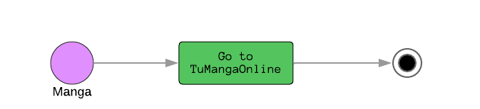

# Aruppi Project - Backend
This is the documentation of the project to develop in the programming models course, at Universidad Distrital. Which applies design patterns, object oriented programming, including databases. Look for apply good practices.

## Business Model
Access to Japanese culture content is often limited or has some problems, such as publicity. In contrast to this, Aruppi is an application that looks to collect all the Japanese culture in an a same place, that is to say, the already mentioned contents, with news that are also related to them.

## User Stories
- As a __user__, I want __watch anime__, so what I hang out.
- As a __user__, I want __read manga__, so what entertainment.
- As a  __user__, I want __listen Japanese stations__, so what I learn Japanese music and know facts of their country.
- As a  __user__, I want __know the news about Japanese culture__, so what I keep me informed.
- As a  __user__, I want __add my favorite content__, so what I categorize them according to my preferences.
- As a  __user__, I want __see my history of episodes__, so what I don't lose the thread of it.
- As a  __user__, I want __add content to the list queue__, so what I can see it after.

## Technical Definitions
### Tools to use
The tools that will be used in the construction of this project are: 
- Visual Studio code, a code editor.
-  Python programming language.
-  Docker to facilitate the implementation and execution of the project.
-  Lucidchart for the creation of software desing.

### Entities
- User: UserId, NumberEpisodes, satus, Progress[E], Favorites[E], Queue[E], Recommended[E]
- Anime: id, ContentName, url, image, description, type, episodeAmount, category, animationStudio, producer.
- Manga:  id, ContentName, url, image.
- Radio:  id, ContentName, url, image, station.
- News:  id, ContentName, url, image, description.
- Progress: UserId, id, NumberEpisodes, status.
- Queue: UserId, id.
- Favorites: UserId, id.
- Recommend: UserId, id.

## Process
For understand Aruppi process, were create Activity Diagramas.
Activity diagrams the differents process that there are in Aruppi.

### Anime Activity Diagram

### Manga Activity Diagram

### News Activity Diagram

### Preferences Activity Diagram

### Radio Activity Diagram

### User History Activity Diagram

